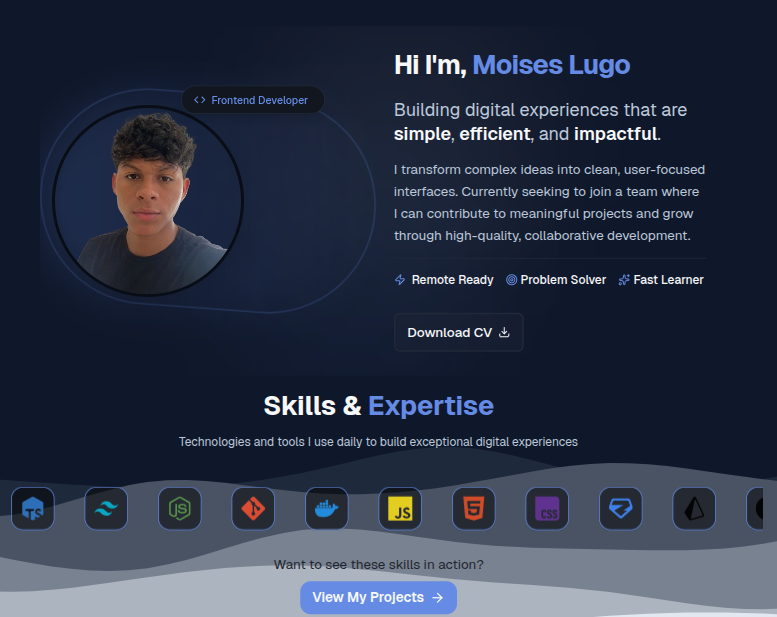
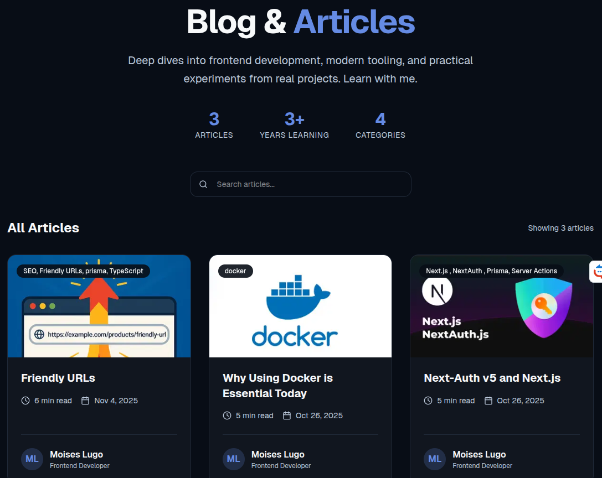

# 🚀 Personal Portfolio Website


A modern, full-stack personal portfolio website built with Next.js, featuring a blog section for sharing learnings, a projects showcase, and an admin panel for content management. Designed to be responsive, accessible, and visually appealing for developers and recruiters.

## ✨ Features

- **Blog Section**: Share your learnings with markdown support, code highlighting, and search functionality.
- **Projects Showcase**: Display real code projects with descriptions, images, and links.
- **Admin Panel**: Secure authentication for adding, editing, and deleting blog posts and projects.
- **Responsive Design**: Optimized for all devices with dark/light theme support.
- **SEO Optimized**: Built with Next.js for fast loading and search engine visibility.
- **Modern UI**: Clean interface using Shadcn UI components and Tailwind CSS.

## 🛠 Installation

### Prerequisites

- Node.js (version 18 or higher)
- PostgreSQL database
- pnpm (recommended) or npm/yarn

### Steps

1. **Clone the repository:**

   ```bash
   git clone https://github.com/moiseslugo-04/mini-blog.git
   cd mini-blog
   ```

2. **Install dependencies:**

   ```bash
   pnpm install
   ```

3. **Set up the database:**

   - Create a PostgreSQL database
   - Update the `.env` file with your database URL and other secrets (e.g., NextAuth secret)

4. **Generate Prisma client:**

   ```bash
   pnpm prisma:generate
   ```

5. **Run database migrations:**

   ```bash
   pnpm prisma db push
   ```

6. **Start the development server:**
   ```bash
   pnpm dev
   ```

The application will be available at `http://localhost:3000`.

## 🚀 Usage

### Development

```bash
pnpm dev
```

### Building for Production

```bash
pnpm build
pnpm start
```

### Linting

```bash
pnpm lint
```

### Admin Panel Usage

- Navigate to `/login` to authenticate as an admin.
- Once logged in, access `/dashboard` to manage blog posts and projects.
- Add new blog posts by filling out the form with title, content (markdown), and metadata.
- Upload images for projects via the integrated Cloudinary support.

## 📸 Screenshots

### Home Page



### Blog Section



_Additional screenshots and GIFs demonstrating the admin panel and project showcase are available in the `public/` directory._

## 🛠 Technologies Used

- **Frontend**: Next.js 16, React 19, TypeScript
- **Styling**: Tailwind CSS, Shadcn UI
- **Backend**: Next.js API Routes, Server Actions
- **Database**: Prisma ORM, PostgreSQL
- **Authentication**: NextAuth.js v5
- **Forms**: React Hook Form, Zod for validation
- **Markdown**: React Markdown with rehype-highlight
- **Image Hosting**: Cloudinary
- **Deployment**: Vercel (recommended)

## 🤝 Contributing

Contributions are welcome! Please follow these steps:

1. Fork the repository
2. Create a feature branch (`git checkout -b feature/amazing-feature`)
3. Commit your changes (`git commit -m 'Add some amazing feature'`)
4. Push to the branch (`git push origin feature/amazing-feature`)
5. Open a Pull Request

Please ensure your code follows the project's coding standards and includes appropriate tests.

## 📄 License

This project is licensed under the MIT License - see the [LICENSE](LICENSE) file for details.

## 📧 Contact

**Moises Lugo**

- GitHub: [@moiseslugo-04](https://github.com/moiseslugo-04)
- LinkedIn: [Your LinkedIn Profile](https://linkedin.com/in/yourprofile)
- Email: your.email@example.com
- Portfolio: [https://moiseslugo.com](https://moiseslugo.com)

Feel free to reach out for collaborations, opportunities, or questions!
